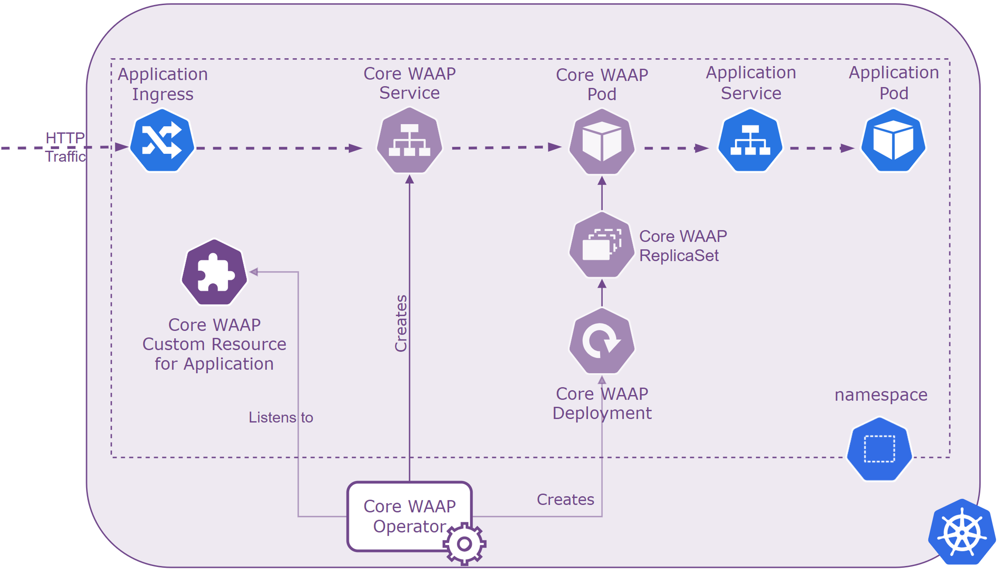
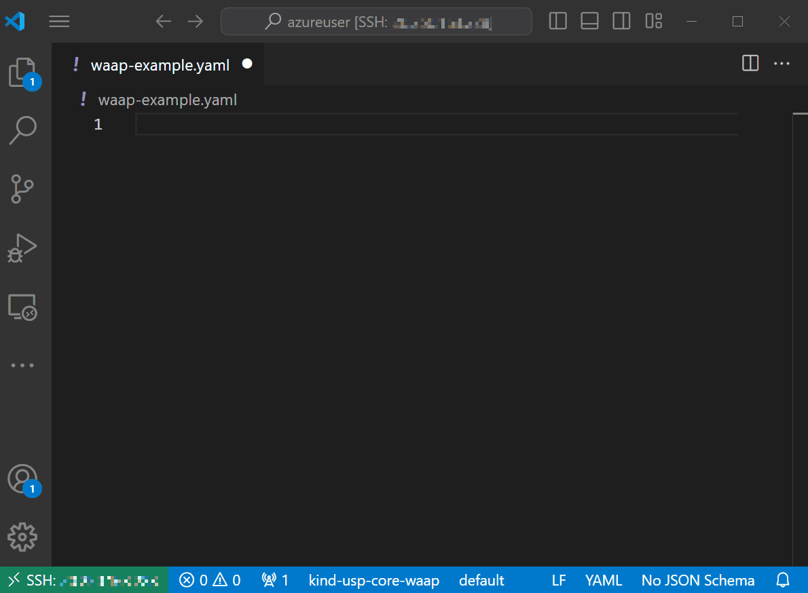

> For AI agents: this documentation is indexed at https://docs.united-security-providers.ch/usp-core-waap/llms.txt, and every page is available as markdown at its own address plus index.md.

# USP Core WAAP

USP Core WAAP (Web Application and API Protection) provides secure access to web-based applications and resources,
while simplifying the process of configuration and deployment.

* Current Helm charts version for USP Core WAAP operator : [1.4.1](release-notes/helm-CHANGELOG.md)
    * Current USP Core WAAP operator release version: [1.3.1](release-notes/operator-CHANGELOG.md)
    * Current Core WAAP image: [1.4.1](release-notes/waap-CHANGELOG.md)
        * Current extProc ICAP image: [1.0.0](release-notes/ext-proc-icap-CHANGELOG.md)
        * Current extProc OpenAPI image: [0.0.6](release-notes/ext-proc-openapi-CHANGELOG.md)

## Overview

For Kubernetes we provide the Core WAAP Operator which deploys Core WAAP based on a Custom 
Resource with the respective services and pods. With Core WAAP, the security configuration can be fully integrated in applications continuous integration and delivery process 
while enabling developers move from DevOps to SecDevOps.

## Configuring Core WAAP

A basic Core WAAP configuration looks as follows.

## Getting Started

To pull the Operator helm chart and corresponding container images you need a key. Get in contact with us, we are looking forward to support you.
[Web Application &#038; API Protection (WAAP) &#8211; United Security Providers AG](https://www.united-security-providers.ch/technology/application-security/web-application-api-protection-waap/#more)

If you want to try the Core WAAP yourself head over to the [Killercoda Core WAAP scenarios](https://killercoda.com/united-security-providers).

## Pages

- [Changelog](https://docs.united-security-providers.ch/usp-core-waap/1.4.x/release-notes/helm-CHANGELOG/index.md)
- [Changelog](https://docs.united-security-providers.ch/usp-core-waap/1.4.x/release-notes/operator-CHANGELOG/index.md)
- [Changelog](https://docs.united-security-providers.ch/usp-core-waap/1.4.x/release-notes/waap-CHANGELOG/index.md)
- [Changelog](https://docs.united-security-providers.ch/usp-core-waap/1.4.x/release-notes/ext-proc-icap-CHANGELOG/index.md)
- [Changelog](https://docs.united-security-providers.ch/usp-core-waap/1.4.x/release-notes/ext-proc-openapi-CHANGELOG/index.md)
- [API Reference](https://docs.united-security-providers.ch/usp-core-waap/1.4.x/configuration/crd-doc/index.md)
- [What is Coraza?](https://docs.united-security-providers.ch/usp-core-waap/1.4.x/configuration/coraza/what-is-coraza/index.md)
- [CRS Basic Usage](https://docs.united-security-providers.ch/usp-core-waap/1.4.x/configuration/coraza/coraza-crs/index.md)
- [GraphQL Basic Usage](https://docs.united-security-providers.ch/usp-core-waap/1.4.x/configuration/coraza/coraza-graphql/index.md)
- [Error Mapping](https://docs.united-security-providers.ch/usp-core-waap/1.4.x/configuration/error-mapping/index.md)
- [Native Config Post-Processing (NCPP)](https://docs.united-security-providers.ch/usp-core-waap/1.4.x/configuration/native-config-post-processing/index.md)
- [Traffic Processing](https://docs.united-security-providers.ch/usp-core-waap/1.4.x/configuration/traffic-processing/traffic-processing-overview/index.md)
- [ICAP Antivirus Scanning](https://docs.united-security-providers.ch/usp-core-waap/1.4.x/configuration/traffic-processing/icap-antivirus-scanning/index.md)
- [OpenAPI Validation](https://docs.united-security-providers.ch/usp-core-waap/1.4.x/configuration/traffic-processing/openapi-validation/index.md)
- [Virtual Patch](https://docs.united-security-providers.ch/usp-core-waap/1.4.x/configuration/crs-virtual-patch/index.md)
- [Lua Filters](https://docs.united-security-providers.ch/usp-core-waap/1.4.x/configuration/lua-filters/index.md)
- [Helm Charts](https://docs.united-security-providers.ch/usp-core-waap/1.4.x/operation/helm/usage/index.md)
- [usp-core-waap-operator](https://docs.united-security-providers.ch/usp-core-waap/1.4.x/operation/helm/values/index.md)
- [Updating Core WAAP Operator](https://docs.united-security-providers.ch/usp-core-waap/1.4.x/operation/upgrade/index.md)
- [Logs and Metrics](https://docs.united-security-providers.ch/usp-core-waap/1.4.x/operation/logs-metrics/index.md)
- [Auto-Learning](https://docs.united-security-providers.ch/usp-core-waap/1.4.x/operation/autolearning/index.md)
- [Handling large request and response payloads with OWASP CRS attack detection](https://docs.united-security-providers.ch/usp-core-waap/1.4.x/operation/large-payloads/index.md)
- [Legacy Settings: Handling large request and response payloads with OWASP CRS attack detection](https://docs.united-security-providers.ch/usp-core-waap/1.4.x/operation/large-payloads-legacy/index.md)
- [OAuth2 / OIDC](https://docs.united-security-providers.ch/usp-core-waap/1.4.x/operation/oidc-operation/index.md)
- [Downloads](https://docs.united-security-providers.ch/usp-core-waap/1.4.x/downloads/index.md)
